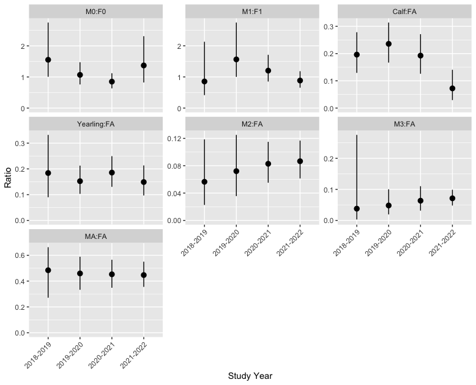

# Statement of Need

Knowledge of population status and trends is integral to the effective conservation and management of wildlife populations. 
To this end, demographic ratios (e.g., Calf:Cow ratios, Fig. 1) are routinely used in wildlife management as a readily observable measure of productivity and for forecasting population trajectories [@fuller2007; @wittmer2005; @bender2006]. 
More complex state-space population modeling approaches [@buckland2004; @paterson2019; @mizuki2020; @newman2023] can also be used to estimate survival and fecundity.
To understand the age composition of a population, both of these approaches require classified (by age and sex) counts of individuals.

In remote areas, estimates of herd size and composition are typically obtained from aerial surveys. 
However, distinguishing animal age and sex can be challenging, particularly in forested environments if animals flee or hide from aircraft. 
Remote cameras present an alternative method for obtaining classified counts. 
Wildlife cameras have been used to estimate species occupancy, density, behaviour, and to identify individuals through distinct markings [@magoun2011; @steenweg2016; @caravaggi2017; @green2020; @nakashima2020; @singh2022]. 
Although different age and sex classes can be readily distinguished in remote camera photos for many ungulate species [@laskin2020], it is rare that classified count data are used to estimate population parameters without using individual markings (but see @horneestimating2021, @chitwoodare2017, @ikedaevaluation2013).

 represents a group of entirely calves.")

*Figure 1. Data exploration plot from the shinybisonpic app, showing calf:cow ratios over time from individual remote cameras in the Ronald Lake Wood Bison range in northeast Alberta. Ratios are shown with camera trap ID, date of observation, study year, season, and group size. A ratio of 0 represents a group of entirely cows, while an infinite ratio (Inf) represents a group of entirely calves.*

# Summary

We present a method utilizing classified counts from remote cameras to evaluate wood bison (*Bison bison athabascae*) herd demographics.
We modeled demographic ratios, survival, and productivity using a Bayesian integrated population model (IPM) to combine stage-structured information from multiple data sources and estimate demographic states and transitions [@schaubintegrated2022]. 
The data included the classified counts from camera trap observations, and census and proportion of calves estimates from aerial surveys.

The counts of classified individuals from each camera trap observation were represented by a series of binomial distributions, as opposed to a multinomial distribution, which allowed us to account for individuals that were classified by age, but not by sex.
The binomial distributions informed both the counts of each age class (calf, yearling, adult) and corresponding sex ratios.
The probabilities for each of the binomial draws were informed by the estimated proportions of individuals in each age and sex class in the population on a given date, which was modeled using a Birth-Age-Survival (BAS) subprocess formulation of a population projection model [@newmanmodelling2014].

For example, the count of calves at the $i^{th}$ camera trap observation was modeled as follows: 

$$C_i \sim \text{Binomial}(N_i, p_{C_i})$$

where $C_i$ is the number of calves, $N_i$ is the total group size, and $p_{C_i}$ is the sum of the expected proportions of male and female calves on the date of the $i^{th}$ observation.

The sex ratio of calves was modeled as follows:

$$F0_i \sim \text{Binomial}\Biggl(F0_i + M0_i, \frac{p_{F0_i}}{p_{F0_i} + p_{M0_i}}\Biggr)$$

where $F0_i$ is the number of female calves, $M0_i$ is the total number of male calves, and $p_{F0_i}$ and $p_{M0_i}$ are the expected proportion of female and male calves on the date of the $i^{th}$ observation, respectively.

The population projection model also estimated the fecundity rate, the proportion of fecund cows aged two and older, the annually-varying survival rates for each class, and can produce derived estimates of several key population ratios (Fig. 2).
The information from the aerial surveys was integrated into the model, helping to inform the total number of individuals (i.e., the sum of the class-wise abundances) and the proportion of calves (i.e., $p_{F0_i} + p_{M0_i}$) on the dates of the aerial surveys.
A Gaussian process regression [@mcelreath2016] accounted for the spatial and temporal correlation structure of the camera trap observations.
Collectively, these methods could be applied non-invasively to a wide array of difficult to survey species to estimate key parameters that drive population dynamics.

*Figure 2. Example of a prediction plot from the runbisonpic app, showing estimated population ratios for the Ronald Lake Wood Bison herd, by study year. M0 and F0 are male and female calves, M1 and F1 are male and female yearlings, Calf and Yearling represent all individuals within those age classes including those with unknown sex, M2 and M3 represent male two- and three-year-olds, MA represents males aged four and older, and FA represents females aged two and older.*

This method is implemented using four related R packages.
The underlying functionality to check, clean, process, model, and visualize data is provided by `bisonpictools`.
The other two R packages are apps that provide a user-friendly interface to `bisonpictools`. 
The first app is `shinybisonpic`, a web-based app that allows users to upload and explore the data by viewing the locations of cameras and the ratios of selected sex-age groups (e.g., Fig. 1). 
The second app is `runbisonpic`, a locally-run app that allows users with various skill levels to run a model to estimate the abundance by class, total abundance, survival and fecundity rates, and various sex-age ratios (e.g., Fig. 2).
The `bisonpicsuite` package loads the three other packages.
The software suite was developed for Alberta Environment and Protected Areas to use remote game cameras to estimate the composition, status, and trends of the Ronald Lake Wood Bison herd.

# Limitations

- The model can take over 5 hours to run.
- Key assumptions of the integrated population model include:
  - There is no grouping structure beyond what is accounted for by the covariance.
  - Every stage is equally detectable during a camera trap event.
  - Small and large groups are equally detectable.

# Acknowledgements

This work was funded by Alberta Environment and Protected Areas.
We thank Troy Hegel, Joe Thorley, and John Boulanger for senior review.

# References
