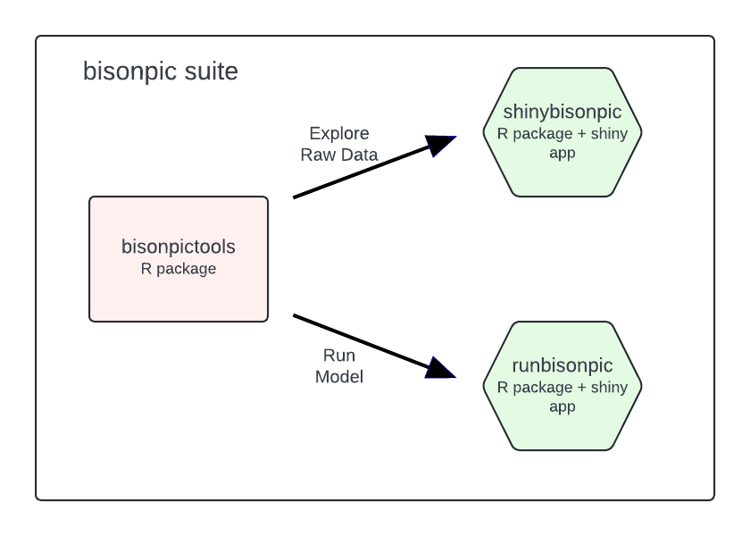

<!-- Copyright 2023 Province of Alberta -->

<!-- Licensed under the Apache License, Version 2.0 (the "License"); -->
<!-- you may not use this file except in compliance with the License. -->
<!-- You may obtain a copy of the License at -->

<!-- http://www.apache.org/licenses/LICENSE-2.0 -->

<!-- Unless required by applicable law or agreed to in writing, software -->
<!-- distributed under the License is distributed on an "AS IS" BASIS, -->
<!-- WITHOUT WARRANTIES OR CONDITIONS OF ANY KIND, either express or implied. -->
<!-- See the License for the specific language governing permissions and -->
<!-- limitations under the License. -->

```{r, include = FALSE}
knitr::opts_chunk$set(
  collapse = TRUE,
  comment = "#>"
)
```

The goal of the bisonpic suite of tools (all loaded by `bisonpicsuite`) is to facilitate the visualization and analysis of camera trap data for wood bison herds.

In order to use the bisonpic suite of packages (`bisonpicsuite`) you need to install R (see below).

## Installation

In order to install R [@r_core_team_r_2023] the appropriate binary for the user's operating system should be downloaded from [CRAN](https://cran.r-project.org/) and then installed.
RStudio is a helpful user interface for R, and can be downloaded [here](https://posit.co/download/rstudio-desktop/).

To install the latest development version of `bisonpicsuite`, execute the following code in the RStudio console.
This will install the full suite of bisonpic software (see below).

```{r, eval = FALSE}
install.packages("remotes")
remotes::install_github("poissonconsulting/bisonpicsuite")
```

Load the bisonpic suite of packages by executing the following code

```{r}
library(bisonpicsuite)
```


## bisonpic suite

The bisonpic suite includes the following packages:

- [`bisonpictools`](https://github.com/poissonconsulting/bisonpictools)
- [`shinybisonpic`](https://github.com/poissonconsulting/shinybisonpic)
- [`runbisonpic`](https://github.com/poissonconsulting/runbisonpic)

`bisonpictools` provides the underlying visualization and analysis functionality; `shinybisonpic` is a web-based Shiny app that provides a Graphical User Interface to facilitate data visualization and exploration, and `runbisonpic` is a local-based Shiny app to set up and run an analysis.

```{r, echo = FALSE, out.width = '70%'}

```

## Data 

In both the `shinybisonpic` and `runbisonpic` Shiny apps, the user can download a templated excel spreadsheet to populate the following data tables:

- `event_data` contains the camera trap event data, including the date and time of each event, location of the camera trap, and the number of individuals in each class
- `location_data` contains the coordinates of the camera traps
- `census_data` contains census estimates of the population from aerial surveys, and the date of the surveys
- `proportion_calf_data` contains estimates of the proportion of calves in the population from aerial surveys, and the date of the surveys

The template contains information about what is required in each column.
When uploaded, the data is checked to ensure correct formatting.
We suggest downloading the template from one of the Shiny apps and populating it, to ensure the tables have the correct sheet and column names, even if the user wishes to use the RStudio console to run the data visualization and/or analysis steps.

## Data Visualization

### `shinybisonpic`

Use the [`shinybisonpic` Shiny app](https://poissonconsulting.shinyapps.io/shinybisonpic/) to explore the locations of camera traps and the the ratios of different classes of wood bison in camera trap observations.
Refer to the [user guide](https://poissonconsulting.github.io/bisonpicsuite/articles/bisonpic-user-guide.html) for more information on how to use the `shinybisonpic` app.

## Data Analysis

### `runbisonpic`

Launch the local data analysis app by running the following lines of code in the RStudio console.

```{r, eval = FALSE}
# Launch local app
runbisonpic::launch_runbisonpic()
```

See the [user guide](https://poissonconsulting.github.io/bisonpicsuite/articles/user-guide.html) for more guidance on how to use the `runbisonpic` app.

## Using the RStudio Console

Data visualization and analysis can alternatively be done in the RStudio console by running the functions from `bisonpictools` that form the basis of both of the above shiny apps.
See the ["Getting Started with bisonpictools"](https://poissonconsulting.github.io/bisonpictools/articles/bisonpictools-getting-started.html) article for more detail.

## Contribution

Please report any [issues](https://github.com/poissonconsulting/bisonpicsuite/issues).

## Code of Conduct

Please note that the `bisonpicsuite` project is released with a [Contributor Code of Conduct](https://www.contributor-covenant.org/version/2/1/code_of_conduct/).
By contributing to this project, you agree to abide by its terms.

## References

<div id="refs"></div>

```{r, results = "asis", echo = FALSE}
cat(bisonpictools::bpt_licensing_md())
```

